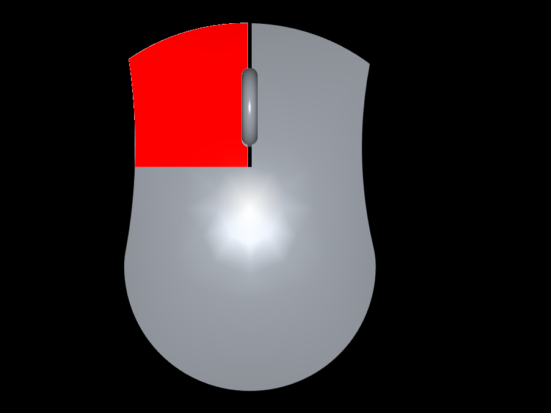
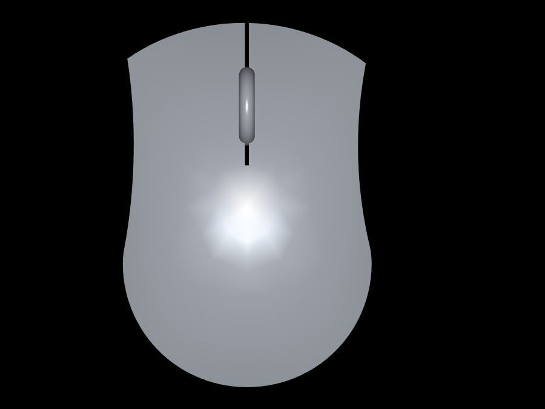

> [!CAUTION]
> this app is no longer maintained. use [IMS](https://github.com/muezabdalla/IMS) (input monitoring system)
> it shows both the keyboard and mouse.
# mouse-sun



this is the image when you click the left button.

## The mouse monitoring software for linux
this is a software to show the mouse clicks on screen. it is useful when making a tutorial video so that learners know what you pressed.

[comment]: # ()

## how to install
first download the tar file from the [releases](https://github.com/muezabdalla/mouse-sun/releases)
note: download the mouse-sun.tar not the source code(the source code is for building from source)

then extract the tar file with this command:

```
tar -xf mouse-sun.tar
```

then move inside the new folder

```
cd mouse-sun*
```

then install the dependancies

### dependancies:

- SDL2
- SDL2_image

installing dependancies on void linux:

```
sudo xbps-install SDL2 SDL2_image
```

installing dependancies on debian-based linux:

```
sudo apt install libsdl2 libsdl2-image
```

then to run it:

```
./mouse-sun
```

## building from source

### dependancies:

- SDL2-devel
- SDL2_image-devel
- gcc (only for compilation)
- make (only for compilation)

for void linux:

```
sudo xbps-install SDL2-devel SDL2_image-devel make gcc
```

for debian-based linux:

```
sudo apt install libsdl2-dev libsdl2-image-dev make gcc
```

after installing the dependancies, download the repository and `cd` into it and run this command to build from source:

```
make install
```

if you want to remove the package run:

```
make clean
```

to run it:

```
./mouse-sun
```

## common issues:

- if it does not show effect when you click that means you should change the input file by using -i flag. this is becouse the input file for your mouse file might be differant so check the event file in your `/dev/input/eventX' where X might be any number.
for example if you want to check `/dev/input/event2` then run `cat /dev/input/event2` then move the mouse if there is an output it means that this is the mouse input file else try another file.
- if when you use `cat /dev/input/event0` you get authentication failed or something like that. then you have two options. first: run the program as root (not recommended) second: add yourself to the input group

## other project:
key_sun a keyboard monitoring software 
